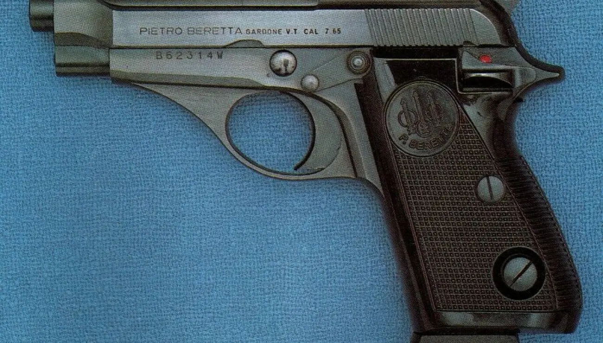
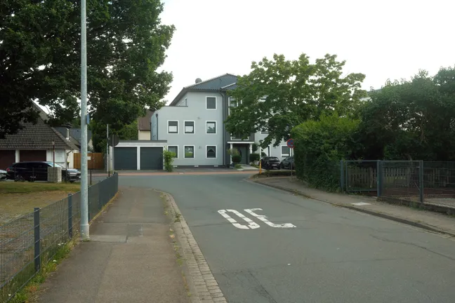
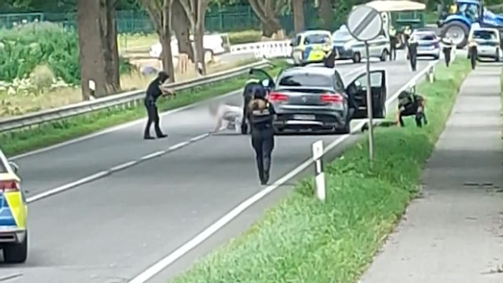
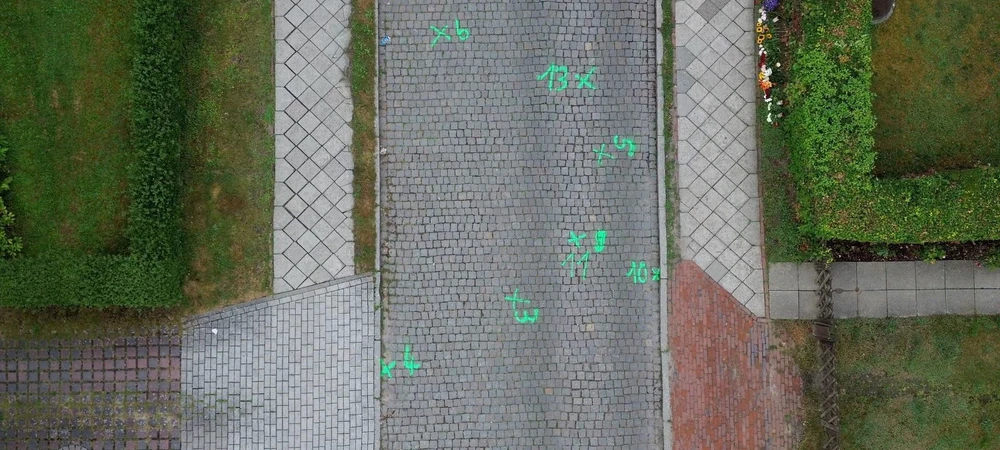
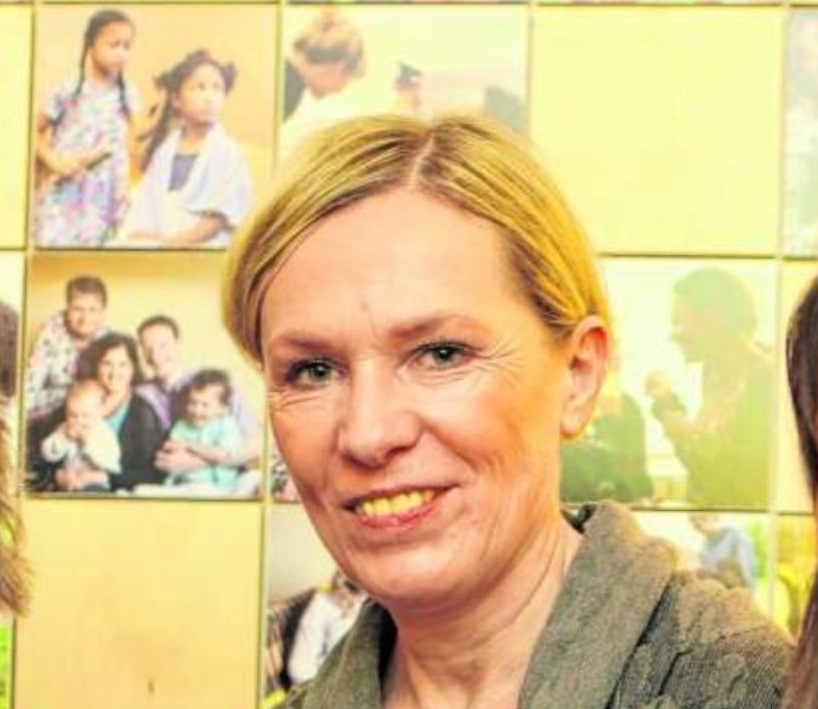
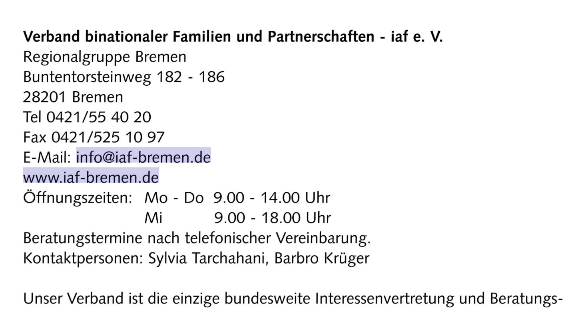

# Fatih Khan G. vs Jugendamt Hannover 2026-06-29

good news! wir haben 6 probleme weniger: 6 tote bullen in stade bei hannover in niedersachsen

- jugendamt nimmt einem vater das sorgerecht für sein kind,
weil angeblich ist der vater "erziehungsunfähig" aus irgendwelchen bullshit-"gründen"  
- vater tötet 6 jugendamt-bullen  
- lügenpresse feiert die jugendamt-bullen als "opfer",
lügenpresse verteufelt den vater als "täter"  

also wie immer, verschwörung, täterschutz, täter-opfer umkehr

"sechs Mitarbeiter der Jugendhilfe regelrecht hingerichtet"  
mit sehr guten gründen.  
wem das jugendamt seine kinder nicht weggenommen hat, der soll hier mal schön seine fresse halten.  
null mitleid mit diesen staatlich-geprüften kinderfickern.  
jeder tote von denen ist ein problem weniger.  
justizversagen = freibrief zur selbstjustiz.  
tyrannenmord ist illegal aber legitim.

> Hirnblutungen infolge eines möglichen Schütteltraumas

> Misshandlung von Schutzbefohlenen

tja. in meiner welt gehören kinder ihren eltern, und nicht dem staat.  
also in meiner welt dürfen eltern ihre kinder auch foltern oder töten,  
das ist nicht mein problem, und jede staatliche "lösung" macht das problem nur schlimmer.

und: in meiner welt gibt es keine krankenversicherungen,  
also wenn eltern ihr kind zum krüppel schlagen  
und dann das kind ins krankenhaus bringen  
damit ärzte das kind wieder "reparieren"  
(spoiler: es wird nie wieder gesund)  
dann sollen die eltern diese reparatur zu 100% selbst bezahlen  
wenn das leben von ihrem kind so "wertvoll" ist

> Mordmerkmale der Heimtücke und der niedrigen Beweggründe

haha, solchen bullshit labern die immer wenn einer auf bullen schiesst  
cops hassen copkiller, aber copkiller sind volkshelden

https://www.mopo.de/im-norden/niedersachsen/blutbad-von-stade-drei-tage-vor-der-tat-schickt-die-patentante-dieses-mysterioese-schreiben/4862095

<blockquote>

# Blutbad von Stade: Drei Tage vor der Tat schickt die Patentante dieses mysteriöse Schreiben

Olaf Wunder

2. Juli 2026 - 21:20

<blockquote>

<blockquote>

# Chronologie eines Alptraums – Der Fall Ar.

Ort: Medizinische Hochschule Hannover  
Zeitraum: 12.04.-15.05.2026

A. kommt am 7.3.2026 – ein paar Wochen zu früh – auf die Welt. Sie wiegt 2.990 g und ist 50 cm groß. Beide Eltern kümmern sich gemeinsam um ihr Baby.

Seit dem 7.4.2026 fiel den Eltern auf, dass ihre Tochter deutlich unruhiger war als zuvor und vermehrt weinte. Sie suchte verstärkt Körperkontakt und beruhigte sich zuverlässig, sobald sie auf dem Arm gehalten oder mit direktem Hautkontakt versorgt wurde. Wurde sie anschließend wieder in ihr eigenes Bett gelegt, begann sie erneut zu weinen. Dieses Verhalten zeigte sie sowohl am 7.4.2026 als auch am 8.4.2026

Um zu vermeiden, dass der Vater mit dem Kind auf dem Arm einschläft und es dabei zu einem Sturz kommen könnte, legte er seine Tochter in der Nacht vom 8.4.2026 ... auf ein Daunenkissen in die Mitte des Elternbettes. Er hielt ... wodurch sie einschlief, während er selbst am Rand ...

... beabsichtigten ...

</blockquote>

Blutbad von Stade: Drei Tage vor der Tat schickt die Patentante dieses mysteriöse Schreiben. Es hat 20 Seiten. Überschrift: „Chronologie eines Albtraums". Olaf Wunder

</blockquote>

Fatih Khan G. aus Garbsen (45) soll sechs Menschen erschossen haben. Die 65-jährige Frau, die den Fluchtwagen fuhr, ist Schwiegermutter eines bekannten SPD-Politikers. Welche Rolle spielt sie in dem Fall?

Sechs Menschen sterben am Montagmittag in Stade: drei Beschäftigte des Jugendamts der Region Hannover und drei Mitarbeiter einer Stader Jugendhilfeeinrichtung. Der mutmaßliche Täter ist Fatih Khan G. aus Garbsen, 45 Jahre alt, in Deutschland geboren, türkischer Staatsbürger. Eine 65-jährige Frau aus Bremen, die sich selbst als Patentante seiner drei Monate alten Tochter bezeichnet, hatte ihn noch kurz vor der Tat öffentlich in Schutz genommen. Nun wird bekannt: Die Frau ist die Schwiegermutter des SPD-Landtagsabgeordneten Deniz Kurku (43).

Welche Rolle die 65-Jährige tatsächlich spielte, ist Gegenstand der Ermittlungen. Nach der Tat sitzt sie am Steuer des Mercedes, in dem G. vom Tatort flüchtet. Nach Spiegel-Informationen soll sie während der Schüsse allerdings im Auto gewartet haben. G. soll sie anschließend mit vorgehaltener Pistole gezwungen haben, loszufahren. Die Waffe sei zu diesem Zeitpunkt nicht geladen gewesen.

Deniz Kurku (SPD) im Niedersächsischen Landtag während der Wahl des Ministerpräsidenten in Hannover.

<blockquote>


Der SPD-Politiker Deniz Kurku ist Schwiegersohn der 65-Jährigen, die das Fluchtfahrzeug des mutmaßlichen Täters von Stade fuhr. picture alliance / dts-Agentur

</blockquote>

Die Vorgeschichte beginnt Mitte April. Das damals fünf Wochen alte Baby der jungen Familie wird in der Medizinischen Hochschule Hannover behandelt. Nach MOPO-Informationen stellen Ärzte bei dem kleinen Mädchen eine Hirnblutung fest und sprechen von einem möglichen Schütteltrauma. Die Eltern bestreiten vehement, ihre Tochter misshandelt zu haben. Es kommt zum Streit mit dem Vater. Ärzte erstatten Anzeige gegen Fatih Khan G. wegen Bedrohung. Auch G. nimmt sich einen Anwalt und erstattet Anfang Mai Strafanzeige gegen mehrere Mediziner.

## Mutmaßlicher Todesschütze von Stade: Wurde das Baby misshandelt?

Gegen die Eltern wird wegen Misshandlung von Schutzbefohlenen ermittelt. Nach der Entlassung des Kindes aus der Klinik leitet das Jugendamt die Inobhutnahme ein. Mutter und Vater werden zunächst von ihrer Tochter getrennt. Später ordnet ein Familiengericht an, dass der Säugling wieder mit der Mutter zusammengeführt werden muss – allerdings in einer Mutter-Kind-Einrichtung. So kommen Mutter und Kind am 26. Mai in die Spezial-Einrichtung nach Stade.

Die 65-jährige Bremerin Erika Sch. (Name geändert) kennt die Familie des mutmaßlichen Täters seit längerer Zeit und unterstützt sie. Sie arbeitet als Beraterin für einen Verband, der sich selbst als „Schnittstelle von Familien-, Bildungs- und Migrationspolitik“ versteht. Sie bezeichnet sich als Patentante des Kindes.  

## „Chronologie eines Albtraums“: Schwere Vorwürfe gegen Klinik und Jugendamt

Drei Tage vor dem Blutbad, am Freitag, 26. Juni, verschickt Erika Sch. per Mail ein 20-seitiges Papier an mehrere Medienhäuser. Überschrift: „Chronologie eines Albtraums“. Sie will öffentlich machen, welches Unrecht Fatih Khan G. und seiner Partnerin aus ihrer Sicht widerfahren sei. Der MOPO liegt der Text vor.

In dem Schreiben erhebt Sch. schwere Vorwürfe gegen Klinik, Jugendamt und Justiz. Sie behauptet, die Verletzungen des Babys seien nicht durch Schütteln entstanden, sondern durch einen unbeabsichtigten Zusammenstoß von Vater und Kind im Elternbett. Niemand habe den Eltern glauben wollen.

Mit Blick auf den Klinikaufenthalt spricht Sch. von Widersprüchen, Ungereimtheiten und unzulänglicher Dokumentation des medizinischen Personals. Klinikmitarbeiter hätten den Kindsvater gegenüber Polizei, Gericht und Jugendhilfeeinrichtung zu Unrecht als aggressiv und unberechenbar geschildert, schreibt sie. Als Polizeibeamte später zur Hausdurchsuchung erschienen seien, hätten sie einen „ruhigen, besonnenen und kooperativen Mann“ angetroffen. Auch die Inobhutnahme des Kindes durch das Jugendamt kritisiert sie scharf.

Viele der Behauptungen, die Erika Sch. in dem Papier aufstellt, lassen sich derzeit nicht unabhängig überprüfen. Ihre Mail ist eine einseitige Verteidigungsschrift zugunsten der Eltern.

## Um 12.10 Uhr fallen die Schüsse, sechs Menschen sterben im Kugelhagel

Am vergangenen Montag kommt es dann zum sogenannten Hilfeplangespräch, das in einer Katastrophe endet. Besprochen werden soll, unter welchen Bedingungen der Kontakt zwischen Fatih Khan G. und seiner Tochter künftig stattfinden kann. Kurz vor 12 Uhr erscheint G. in der Mutter-Kind-Einrichtung in der Dankersstraße 29 im Stader Stadtteil Kopenkamp. Auch die Mutter des Kindes und das Kind selbst sind dabei.

Weil der Vater offenbar als potenziell gefährlich und unberechenbar eingeschätzt wird, ist das Jugendamt der Region Hannover gleich mit drei Mitarbeitern vertreten. Auch drei Beschäftigte der Mutter-Kind-Einrichtung nehmen an dem Termin teil.

Was dann genau geschieht, ist Gegenstand der Ermittlungen. Fest steht: Gegen 12.10 Uhr fallen Schüsse. Nach bisherigen Erkenntnissen zieht G. eine Pistole und schießt. Vier Frauen und zwei Männer werden getroffen. Fünf Personen sterben noch vor Ort, eine später im Krankenhaus. Die Mutter und das Baby bleiben unverletzt.

## Die Tatwaffe: eine Beretta, illegal gekauft für 4000 Euro am Ku'damm

Nach Spiegel-Informationen hat G. den Plan, sich nach der Tat das Leben zu nehmen. Das gelingt ihm nicht, weil er das Magazin leergeschossen hat. Es fehlt ihm schlicht an Munition.

G. flüchtet daraufhin in der Mercedes-AMG-Limousine, in der Erika Sch. während der Tat gewartet haben soll. Nach Spiegel-Informationen zwingt er die 65-Jährige mit vorgehaltener Pistole, loszufahren. Ob sie weiß, dass die Waffe nicht geladen ist, ist offen. Die Polizei versucht, das Fahrzeug durch Schüsse auf die Reifen zu stoppen. Auf der Bundesstraße 73 in Stade-Haddorf wird der Wagen schließlich gestellt.

Die Beamten beschlagnahmen die Pistole. Der Tatverdächtige soll sie sich eine Woche vor der Tat illegal am Kurfürstendamm in Berlin beschafft haben, wie „Bild“ berichtet. Für die Beretta Model 70 und 21 Schuss Munition soll er demnach 4000 Euro gezahlt haben.  

Am Dienstagabend erlässt das Amtsgericht Stade gegen den mutmaßlichen Täter Haftbefehl wegen sechsfachen Mordes. Das Gericht folgt damit dem Antrag der Staatsanwaltschaft. Der 45-Jährige wird in eine Haftanstalt gebracht. Eine eigens eingerichtete Mordkommission übernimmt die Ermittlungen.

<blockquote>



Beretta Modell 70 - mit einer Waffe dieses Modells wurden in Stade sechs Menschen erschossen. Der Tatverdächtige hat die Waffe eine Woche vor der Tat am Ku'damm in Berlin für 4000 Euro erworben. wikpedia/hfr

</blockquote>

Gegen die 34-jährige Mutter des Kindes und die 65-jährige Begleiterin des mutmaßlichen Täters beantragt die Staatsanwaltschaft keine Untersuchungshaft. Beide werden nach der Vernehmung auf freien Fuß gesetzt. Gegen beide wird aber nach Angaben der Staatsanwaltschaft weiter ermittelt. Welche Rolle Erika Sch. tatsächlich spielt und ob ein Tatvorwurf gegen sie erhoben wird, könne erst nach Abschluss der Ermittlungen entschieden werden.

Am Donnerstagabend wird bekannt, dass Erika Sch. die Schwiegermutter des niedersächsischen SPD-Politikers Deniz Kurku ist. Der 43-Jährige bestätigt das. In einer über seinen Anwalt verbreiteten Stellungnahme spricht er den Opfern und ihren Angehörigen seine „tief empfundene Anteilnahme“ aus. Nach Angaben der Landesregierung habe die familiäre Verbindung keine unmittelbaren Auswirkungen auf seine ehrenamtliche Tätigkeit. Kurku sei hoch anerkannt und führe seine Aufgabe „mit größtem persönlichen Engagement aus“, teilte ein Sprecher mit. Ministerpräsident Olaf Lies (SPD) wünsche ihm und seiner Familie die notwendige Kraft für die Bewältigung dieser äußerst schwierigen Situation. 

## Steinmeier schockiert über „Ausmaß der Gewalt in einem Raum, der Schutz geben soll“

Nicht nur in der Bevölkerung, auch in der Politik löst die Gewalttat von Stade Entsetzen aus. Niedersachsens Innenministerin Daniela Behrens (SPD) spricht von einer kaltblütigen Gewalttat. Bundeskanzler Friedrich Merz (CDU) schreibt, die Nachricht aus Stade erschüttere „bis ins Mark“. Auch Bundespräsident Frank-Walter Steinmeier zeigt sich schockiert über „das Ausmaß der Gewalt in einem Raum, der Schutz geben soll“.

Die Gewerkschaft Verdi fordert einen besseren Schutz für Beschäftigte in der sozialen Arbeit. Fachkräfte arbeiteten häufig in hoch eskalierten Familienkonflikten – im Spannungsfeld zwischen Kinderschutz, Opferschutz und dem Kontakt zu Menschen, von denen Gefahr ausgehen kann. Nötig seien mehr Personal, verbindliche Schutzkonzepte, Deeskalationstrainings und klare Notfallabläufe.

## Bischöfin Sabine Preuschoff: „Stade ist eine verwundete Stadt“

Am Dienstagabend kommen in Stade mehrere Hundert Menschen in der St.-Wilhadi-Kirche zusammen, um der sechs Getöteten zu gedenken. Auch Niedersachsens Ministerpräsident Olaf Lies nimmt an der Andacht teil. Besonders schmerze ihn der Gedanke, sagt Lies, dass ausgerechnet Menschen getötet wurden, die anderen helfen und sie schützen wollten. Regionalbischöfin Sabine Preuschoff spricht von einer Gewalttat, die die ganze Stadt erschüttert habe. Stade sei im Moment „eine verwundete Stadt“.

Am Mittwoch versammeln sich auch in der Marktkirche Hannover Hunderte Menschen zu einer Gedenkandacht. Die Kirche ist bis auf den letzten Platz gefüllt, viele Besucher müssen stehen. Viele weinen, immer wieder wischen sich Menschen Tränen aus den Augen. Hannovers Oberbürgermeister Belit Onay (Grüne) sagt, die Gewalttat habe nicht nur Hannover und Stade, sondern das ganze Land erschüttert.

Auch vor dem Haus in der Dankersstraße im Stader Stadtteil Kopenkamp suchen Menschen seit der Tat einen Ort für ihre Trauer. Immer wieder kommen Passanten und Nachbarn vorbei, legen Blumen nieder, stellen Kerzen ab. Manche verharren schweigend vor dem Gebäude. Andere haben Tränen in den Augen. Und immer wieder steht diese eine Frage im Raum: Wie konnte ein Gespräch über den Schutz eines Babys in einem Blutbad enden?

</blockquote>

https://de.wikipedia.org/wiki/Sechsfachmord_von_Stade

<blockquote>

# Sechsfachmord von Stade

Der Sechsfachmord von Stade vom 29. Juni 2026 bezeichnet einen Schusswaffenangriff in einer Mutter-Kind-Einrichtung im niedersächsischen Stade.

Tatverdächtig ist ein in Deutschland geborener 45-jähriger türkischer Staatsangehöriger, der im Zusammenhang mit einem Sorgerechtsstreit zu einem Hilfeplangespräch in der Einrichtung erschienen war und dort insgesamt sechs Mitarbeiterinnen und Mitarbeiter erschoss. Neben drei Angestellten des privaten Trägers befanden sich auch drei Mitarbeitende des Jugendamts Hannover unter den Todesopfern. Der Tatverdächtige floh nach den Schüssen vom Tatort und wurde kurze Zeit später in einem Pkw gestoppt und von Polizeikräften festgenommen. Das Amtsgericht erließ daraufhin Haftbefehl gegen den 45-Jährigen.

## Hintergrund und Tathergang

Am 22. April 2026 wurde die wenige Wochen alte Tochter des 45-jährigen Tatverdächtigen in der Medizinischen Hochschule Hannover (MHH) wegen Hirnblutungen infolge eines möglichen Schütteltraumas notfallmedizinisch behandelt. Nach dem Befund soll der Mann gegenüber den Ärzten der MHH aggressiv aufgetreten sein und ihnen verbal gedroht haben.

Daraufhin leitete das Jugendamt am 15. Mai die Inobhutnahme des Kindes ein. Die Staatsanwaltschaft Hannover nahm Ermittlungen gegen die Eltern wegen des Verdachts der Misshandlung von Schutzbefohlenen auf. Später ordnete ein Familiengericht an, den Säugling wieder mit der 34-jährigen Kindsmutter zusammenzuführen. Mutter und Kind bezogen daraufhin am 26. Mai 2026 eine Mutter-Kind-Einrichtung in Stade.

**Am Tattag, den 29. Juni 2026 erschien der 45-Jährige zu einem Hilfeplangespräch in der Einrichtung. Im Verlauf des Gesprächs eröffnete er das Feuer und tötete sechs Mitarbeiterinnen und Mitarbeiter der Jugendhilfe und des Jugendamts.** Nach Recherchen vom NDR handelte es sich bei der Tatwaffe um eine Pistole des Typs Beretta Modell 70 mit 21 Schuss Munition, die der Tatverdächtige wenige Tage zuvor am Berliner Kurfürstendamm illegal erworben haben soll. Gegen 12:10 Uhr wurde die Polizei wegen der Schüsse alarmiert. Wenig später stoppten Einsatzkräfte den Fluchtwagen und nahmen den mutmaßlichen Täter als Beifahrer eines Mercedes-AMG GLE 43 fest. Auch die 65-jährige Fahrerin des Fahrzeugs, die mutmaßliche Patentante des Kindes, wurde vorläufig festgenommen.

Der Tatverdächtige wurde anschließend in eine Justizvollzugsanstalt gebracht, nachdem das zuständige Amtsgericht Haftbefehl gegen ihn erlassen hatte. Die Staatsanwaltschaft Stade wirft ihm sechsfachen Mord vor. Insbesondere die **Mordmerkmale der Heimtücke und der niedrigen Beweggründe** sieht sie als erfüllt an. Später teilte die Staatsanwaltschaft mit, dass auch gegen die 65-jährige Fluchtwagenfahrerin sowie gegen die Kindsmutter wegen des Verdachts des Mordes ermittelt werde.

Zur Aufklärung der Tat richtete die Polizei eine Mordkommission ein.

## Rolle der Fluchtwagenfahrerin

Die 65-jährige Fluchtwagenfahrerin war mehreren Medienberichten zufolge bereits vor der Tat im Sorgerechtsstreit involviert. Am Freitag, dem 26. Juni, habe sie ein 20-seitiges Dokument an diverse Medienstellen versandt, um den Konflikt zwischen den Eltern und den Behörden in der Region Hannover öffentlich zu machen. Zusätzlich warf sie den behandelnden Ärzten vor, der Version des Vaters, das Kind im Schlaf versehentlich verletzt zu haben, keinen Glauben geschenkt und hierdurch eine Eskalationsspirale gefördert zu haben. Nach Recherchen der HAZ arbeitet die 65-jährige Frau für eine Lobbyorganisation, die binationale Ehepaare berät und sich selbst als „Schnittstelle von Familien-, Bildungs- und Migrationspolitik“ versteht.

Am 2. Juli 2026 wurde bekannt, dass die 65-jährige Fahrerin des Fluchtwagens die Schwiegermutter des niedersächsischen Landesbeauftragten für Migration und Teilhabe, Deniz Kurku (SPD), ist. Kurku erklärte, er habe die familiäre Verbindung nach Bekanntwerden unverzüglich den Ermittlungsbehörden und den zuständigen Stellen in seinem beruflichen Umfeld mitgeteilt und keine Kenntnis von der Tat gehabt. Die SPD-Fraktion sowie Ministerpräsident Olaf Lies stellten sich öffentlich hinter ihn.

## Reaktionen

Bundeskanzler Friedrich Merz schrieb: „Die Nachricht aus Stade erschüttert bis ins Mark … Viele Menschen, die helfen und schützen wollten, haben ihr Leben verloren oder wurden verletzt.“ Auch Bundespräsident Frank-Walter Steinmeier äußerte seine Anteilnahme.

Ministerpräsident Olaf Lies erklärte, die Tat mache die gesamte Landesregierung tief betroffen. Innenministerin Daniela Behrens sprach von einem „entsetzlichen Tag für Stade und für ganz Niedersachsen“. Sechs Menschen seien „auf brutale Weise aus dem Leben gerissen“ worden, erklärte sie. Das verursachte Leid sei „schwer zu begreifen und noch schwerer in Worte zu fassen“. Die Tat werde Stade „lange beschäftigen“ und „Spuren hinterlassen“. Behrens sprach allen Betroffenen ihre Anteilnahme aus.

Am 30. Juni 2026 kehrten rund 700 Menschen zu einer Trauerandacht in die St.-Wilhadi-Kirche ein.

</blockquote>

https://www.tagesspiegel.de/gesellschaft/panorama/sechs-menschen-in-stade-erschossen-staatsanwaltschaft-bestatigt-schutteltrauma-bei-der-tochter-des-tatverdachtigen-15773451.html

> Bei dem mutmaßlichen Täter handelt es sich den Angaben der Polizei nach um einen in Deutschland geborenen Mann mit türkischer Staatsangehörigkeit. Nach Informationen des „Spiegels“ heißt der 45-Jährige **Fatih Khan G.** und lebte in Garbsen bei Hannover. Er sei der Polizei wegen einer früheren Bedrohung bekannt gewesen, habe aber nicht als „absolut gewalttätig“ gegolten. Eine waffenrechtliche Erlaubnis für die verwendete Schusswaffe habe er nicht, hieß es von der Polizei.

https://www.spiegel.de/panorama/justiz/stade-sechs-tote-der-misshandlungsvorwurf-und-ein-seltsamer-brief-a-e6a0adb9-68f5-4d8e-a525-2c5d9821a1ee

https://archive.is/Tm451

<blockquote>

# Sechs Tote. Der Misshandlungsvorwurf. Und ein seltsamer Brief

**Fatih Khan G.** soll in einer Mutter-Kind-Einrichtung sechs Menschen erschossen haben. Zuvor wurde gegen ihn ermittelt, wegen Kindesmisshandlung. Ein Schreiben, das dem SPIEGEL vorliegt, verteidigt ihn.

Von Hubert Gude, Kristin Haug, Florian Kistler, Levin Kubeth und Katherine Rydlink

01.07.2026, 21.38 Uhr

Besonders ruhig ist es hier nicht, die nahe Bundesstraße tost. Zwischen freiwilliger Feuerwehr, einem Pizza-Lieferdienst und einer Arztpraxis steht ein recht neues Mehrfamilienhaus, grau, schlicht – und doch zieren zwei Säulen wie aus dem alten Griechenland die Eingangstür.

Ein bisschen Prunk darf sein. Dazu passt auch der Mercedes-SUV, der auf einem älteren Foto vor dem Haus parkte. Es ist allem Anschein nach dasselbe Auto, das Polizisten am Montag mit Schüssen stoppten.

In diesem Haus in Garbsen-Berenbostel, einem Vorort von Hannover, wohnte Fatih Khan G.

<blockquote>



Wohnhaus des mutmaßlichen Täters in Garbsen: Handy beschlagnahmt

</blockquote>

Am Montagmittag soll G. in einer Mutter-Kind-Einrichtung im rund 140 Kilometer entfernten Stade bei Hamburg sechs Menschen erschossen haben, vier Frauen und zwei Männer. Drei der Opfer arbeiteten für das Jugendamt der Region Hannover, die anderen waren Mitarbeitende der Einrichtung. G. flüchtete, eine 65-jährige Frau am Steuer.

## Bundesweites Entsetzen

Es ist ein Verbrechen, das bundesweit Entsetzen auslöste. »Erschüttert bis ins Mark«, äußerte sich Bundeskanzler Friedrich Merz (CDU). Was trieb den türkischen Staatsbürger Fatih Khan G. zu dieser Wahnsinnstat?

Nach SPIEGEL-Informationen war der 45-Jährige zu einem Hilfeplangespräch mit Mitarbeitern der Einrichtung und Vertretern des Jugendamts verabredet. Bei dem Treffen ging es laut Polizei  um das Sorgerecht für seine drei Monate alte Tochter, die gemeinsam mit der Mutter in Stade untergebracht war. Warum die Situation vor Ort eskalierte, warum G. bewaffnet war, all das müssen die Ermittlungen nun klären.

Die Einrichtung liegt zentral in der niedersächsischen Stadt, ein mehrstöckiges Haus aus rotbraunem Backstein. Der Rasen davor ist gepflegt, im hinteren Garten gibt es ein Klettergerüst, eine Schaukel, eine Rutsche. Es sieht idyllisch aus. Ein »multiprofessionelles pädagogisches Team« betreut hier Schwangere und Mütter mit ihren Kindern, so steht es auf der Website der Einrichtung.

Der Landkreis Stade teilte auf SPIEGEL-Anfrage mit, es sei üblich, Besprechungen mit Angehörigen in Mutter-Kind-Einrichtungen stattfinden zu lassen. Es werde vorher geprüft, ob Besucher gefährlich sein könnten. Jede Einrichtung habe Security-Personal und ihre eigenen Schutzkonzepte. Die Tat verhindern konnte das nicht.

## Teil der elterlichen Sorge vorläufig entzogen

Auslöser für das Sorgerechtsverfahren waren Verletzungen, die Ärzte bei dem Baby im Frühjahr festgestellt hatten. Ein Sprecher der Staatsanwaltschaft Hannover teilte mit, das Kind sei am 12. April in die Medizinische Hochschule Hannover (MHH) gebracht worden. Die Verletzungen könnten demnach auf ein Schütteltrauma hindeuten . Anschließend sei ein Strafverfahren gegen den Vater und die 34-jährige Mutter eingeleitet worden, wegen schwerer Misshandlung von Schutzbefohlenen. »Wir ermitteln aber in alle Richtungen«, so der Sprecher.

Das Kind musste operiert werden. G. soll am 22. April die Klinikärzte bedroht haben, später auch noch mal eine E-Mail verschickt haben. Ein Arzt erstattete Anzeige. Das Verfahren läuft noch.

Ende April durchsuchten Ermittler die Wohnung der Eltern und beschlagnahmten das Handy von G. und Behandlungsunterlagen. Das Amtsgericht Neustadt am Rübenberge ordnete an, dass Mutter und Kind gemeinsam in Stade untergebracht werden sollten, und entzog den Eltern vorläufig einen Teil der elterlichen Sorge. Gegen Letzteres legte G. Beschwerde beim Oberlandesgericht Celle ein. Eine Frist zur Stellungnahme lief am 29. Juni ab. Am Tag der Tat.

## 20-seitiges Schreiben einer angeblichen Patentante

Drei Tage vorher hatte eine Person, die sich die Patentante des Kindes nennt, ein Schreiben an mehrere Medien geschickt, in dem sie eine andere Version der Geschichte schildert. Darin weist sie die Anschuldigungen gegen den Vater zurück und entlastet die Eltern. Sie erhebt ihrerseits **Vorwürfe gegen die MHH und das Jugendamt Hannover: Das Kind sei zu Unrecht in Obhut genommen worden.**

Das Schreiben, das dem SPIEGEL vorliegt, ist 20 Seiten lang und enthält eine detaillierte Darstellung aus Sicht der Familie, Namen beteiligter Ärztinnen und Mitarbeitende der Mutter-Kind-Einrichtung und des Jugendamts, Zitate aus Arztbriefen. Die Staatsanwaltschaft Hannover bestätigt einige Details aus dem Brief.

Laut Darstellung in dem Schreiben wurden **Hirnblutungen** beim Kind diagnostiziert. Diese seien auf einen **Unfall** zurückzuführen. Demnach habe der Säugling am 9. April im Elternbett auf einem Daunenkissen neben dem Vater geschlafen. Gegen 5.30 Uhr habe dieser im Halbschlaf versucht, die Bettdecke zu sich zu ziehen und dabei **versehentlich** ruckartig an dem Kissen gezogen. »Dabei kam es aus seiner Sicht zu einem deutlichen und kräftigen Zusammenstoß zwischen seiner Stirn und der rechten Kopfseite der Tochter«, schreibt die Patentante.

In den darauffolgenden Tagen habe sich das Kind unauffällig verhalten; bei einer Routineuntersuchung seien lediglich Bauchschmerzen festgestellt worden. Am Abend des 12. April – drei Tage nach dem angeblichen Zusammenstoß – habe sich der Zustand des Säuglings den Angaben zufolge verschlechtert, woraufhin die Eltern mit dem Kind ins Krankenhaus gefahren seien. Dort habe »ein nicht enden wollender Albtraum für Kind und Eltern« begonnen.

Das Jugendamt Region Hannover will sich wegen laufender Ermittlungen nicht zu dem Vorfall äußern. Die MHH verweist auf die ärztliche Schweigepflicht, den Datenschutz und das Persönlichkeitsrecht.

War es dieser »Albtraum«, der bei G. in tödlichen Hass umschlug, in eine unfassbar brutale Wut?

</blockquote>

https://www.welt.de/vermischtes/article6a44ca7788b80dfa50d933f6/stade-patentante-soll-vor-der-tat-20-seitiges-schreiben-an-medien-verschickt-haben.html

<blockquote>

Die 65-Jährige ist offenbar stark in den Konflikt der Eltern wegen ihrer Tochter mit dem Jugendamt involviert. Wie die „HAZ“ berichtet, verschickte sie am Freitag, dem 26. Juni, ein 20-seitiges Dokument an mehrere Medien, um so den Fall öffentlich zu machen.

Das Schreiben soll den Titel **„Chronologie eines Albtraums – Der Fall B.“** tragen und sei auffällig juristisch firm gewesen, schreibt die Zeitung. Das könnte auch mit dem beruflichen Hintergrund der Frau zusammenhängen: Nach Recherchen der „HAZ“ arbeitet sie für eine Lobbyorganisation, die binationale Ehepaare berät und sich selbst als „Schnittstelle von Familien-, Bildungs- und Migrationspolitik“ versteht.

In dem Dokument schildert die Patentante demnach ausführlich den Konflikt zwischen den Eltern des Babys mit Ärzten, Behörden und dem Jugendamt. Die „HAZ“ weist allerdings ausdrücklich darauf hin, dass es sich um die Sichtweise der Familie handelt. Viele der Vorwürfe seien nicht unabhängig überprüfbar, weil sich die betroffenen Stellen wegen Datenschutz und Schweigepflicht nicht zu Einzelheiten äußerten.

Ausgelöst worden sei der Konflikt durch eine schwere Kopfverletzung des Kindes. Nach Angaben der Patentante stellten Ärzte eine Hirnblutung fest und vermuteten, der Vater habe das Kind geschüttelt. Dies habe der Mann mit türkischer Staatsangehörigkeit immer bestritten und von einem „unbeabsichtigten Vorfall“ gesprochen. Demnach sei der Vater im Halbschlaf unbeabsichtigt mit seinem Kopf gegen den Kopf des Säuglings gestoßen. Diese Erklärung habe er wiederholt gegenüber Ärzten, Polizei und Jugendamt abgegeben.

Die Patentante wirft den behandelnden Ärzten vor, dieser Version keinen Glauben geschenkt zu haben. Aus ihrer Sicht entwickelte sich daraus eine Eskalationsspirale. Unter anderem soll der Vater den Ärzten auf der Station, auf der seine Tochter lag, sinngemäß mit den Worten gedroht haben: „Wenn meiner Tochter was passiert …“.

Immer wieder soll die Patentante den Vater in dem Schreiben gegen die Vorwürfe von Ärzten und Behörden verteidigt haben, die ihn als „aggressiven, unberechenbaren Mann“ dargestellt hätten. Dieses Bild sei falsch, argumentiert sie. Stattdessen beschreibt sie ihn als „ruhigen, besonnenen und kooperativen Mann“. Als Beleg führt die Frau unter anderem an, dass Polizeibeamte bei einem Kontakt mit dem Vater von dessen Auftreten überrascht gewesen seien und dieser sich sofort zu einer ausführlichen Aussage bereit erklärt habe.

Laut einer Recherche von WELT erschien G. allerdings nach Angaben der behandelnden Ärzte am 22. April in einem äußerst aggressiven Zustand in der Medizinischen Hochschule Hannover, als es um die Behandlung seiner Tochter wegen des Verdachts auf ein Schütteltrauma ging. Er soll die behandelnden Mediziner massiv bedroht und sinngemäß erklärt haben: Sollte seinem Kind in der Klinik etwas passieren, werde er die Verantwortlichen zur Rechenschaft ziehen.

Am 5. Mai ging bei den behandelnden Ärzten nach WELT-Informationen eine weitere E-Mail des Mannes ein, in der er die Mediziner erneut beschimpfte. Die Staatsanwaltschaft Hannover bestätigte WELT, dass das Verfahren wegen Bedrohung eingestellt wurde. Eine strafrechtlich relevante Bedrohung habe nicht vorgelegen.

Schließlich landete der Sorgerechtsstreit vor Gericht. Es entzog den Eltern zunächst das Aufenthaltsbestimmungsrecht, später wurde das Kind aus der Familie genommen. Zudem verfügte das Amtsgericht Neustadt am Rübenberge in seiner Entscheidung, dass den Eltern die Gesundheitssorge entzogen bleibt. Eine Entscheidung des Oberlandesgerichts (OLG) Celle steht noch aus. Der zuständige Familiensenat des OLG hatte den Beteiligten eine Frist zur Stellungnahme bis zum 29. Juni eingeräumt.

Das Dokument der Patentante endet laut „HAZ“ Ende Mai, nachdem ein Gericht entschieden hatte, dass die 34 Jahre alte Mutter zu ihrer Tochter in die Jugendhilfeeinrichtung ziehen darf. Gut fünf Wochen später kam es dort zu dem Termin, der in der Bluttat mündete. An dem Tag sollte ein Hilfeplangespräch stattfinden, um das weitere Vorgehen zu besprechen. Der Verdächtige fuhr offenbar gemeinsam mit seiner Patentante nach Stade.

Dass ein Hilfeplangespräch wie in Stade in der Einrichtung und nicht auf einer Polizeiwache oder bei einem Gericht stattfindet, ist laut niedersächsischem Sozialministerium gängig. „Es gab vereinzelt Fälle in der Vergangenheit, wo auch die Polizei dazugeholt wurde von der Kommune, vom Jugendamt, wenn die Gefahrenlage so eingeschätzt wurde, dass das nötig ist“, sagte Ministeriumssprecherin Lea Karrasch. Dies sei hier nicht der Fall gewesen. Offenbar eine Fehleinschätzung, wie sich dann zeigte.

Die Patentante jedenfalls wartete im Auto, als sich der Verdächtige zu dem Termin mit den Betreuern begab. Ob sie wusste, dass er eine Waffe bei sich trug, ist unklar. Gegen **Fatih G.** wurde inzwischen Haftbefehl erlassen. Eine eingerichtete Mordkommission hat die Ermittlungen übernommen.

Die Staatsanwaltschaft bewertet die Taten aufgrund des Vorliegens von Mordmerkmalen, insbesondere Heimtücke und niederen Beweggründen, als sechsfachen Mord. Unter den sechs Toten sind drei Mitarbeiter des Jugendamtes der Region Hannover und drei der Jugendhilfeeinrichtung der Hansestadt.

Nach der Schließung der betroffenen Mutter-Kind-Gruppe sind die 34-Jährige und ihr Baby anderweitig untergebracht worden, wie das Sozialministerium mitteilte.

</blockquote>

https://www.bild.de/regional/niedersachsen/6-tote-in-stade-schwiegermutter-von-spd-politiker-fuhr-fluchtwagen-6a46a6272a7c6edbda63d771

<blockquote>

Mann erschießt sechs Menschen in Stade

# Schwiegermutter von SPD-Politiker fuhr Fluchtwagen

<blockquote>



Auf dem Bild ist zu sehen, wie der Schütze (rechts) am Montagmittag festgenommen wird. Links richtet ein Polizist seine Dienstwaffe auf die Fahrerin des Mercedes, Sylvia S., die Patentante des drei Monate alten Babys

Foto: privat

</blockquote>

03.07.2026 - 16:52 Uhr

Stade (Niedersachsen) – Aus Wut über einen Sorgerechtsstreit erschoss Fatih G. (45) kaltblütig sechs Menschen in einer Jugendhilfeeinrichtung. Danach raste er in einem Mercedes-AMG vom Tatort. Am Steuer des Fluchtwagens: die mutmaßliche Patentante (65) seiner drei Monate alten Tochter. Jetzt wird bekannt: Sie ist die Schwiegermutter des SPD-Politikers Deniz Kurku (43). Er ist Landesbeauftragter für Migration.

Nach BILD-Informationen hat Kurku die SPD-Fraktion über die familiäre Verbindung informiert. Wie der NDR zuerst berichtete, versendete der Anwalt des Politikers eine offizielle Stellungnahme. In dem Schreiben drückt der Politiker „tief empfundene Anteilnahme“ aus und erklärt, dass die in den Medien erwähnte „Patentante“ des betroffenen Säuglings seine Schwiegermutter sei. Von der Tat wusste er im Vorfeld nichts. Auswirkungen auf sein Amt habe die Verbindung zu dem Fall aus Stade nicht, betonte die SPD. Kurku sei „hoch anerkannt“.

<blockquote>


In diesem Mercedes nahm die Polizei die beiden Verdächtigen fest

Foto: NEWS5

</blockquote>

Die Ermittler prüfen derzeit, welche Rolle Kurkus Schwiegermutter in dem Fall spielt. Ein Haftbefehl gegen die 65-Jährige liegt derzeit nicht vor. Nach BILD-Infos soll sie vor der Tat nichts von Fatih G.s Vorhaben gewusst haben. Der 45-jährige Killer hatte in der Mutter-Kind-Wohngruppe einen Termin für ein Hilfeplangespräch, bei dem es um das Sorgerecht seiner drei Monate alten Tochter ging. Als er nach der Bluttat zu ihr in den Mercedes stieg, soll Fatih G. die Frau mit vorgehaltener Waffe zum Losfahren gezwungen haben. Am Freitag teilte die Staatsanwaltschaft auf BILD-Nachfrage mit, dass nun auch gegen die Schwiegermutter des Politikers und die Mutter des Babys wegen Mordverdachts ermittelt wird.

## Patentante setzte sich für Fatih G. ein

Dabei setzte sich Kurkus Schwiegermutter für den mutmaßlichen Sechsfach-Mörder im Vorfeld ein. Drei Tage vor der Tat verschickte sie ein 20-seitiges Dokument an mehrere Medien. In dem Schreiben berichtet die Patentante über den Sorgerechtsstreit, den Fatih G. und seine Lebenspartnerin mit den Behörden in der Region Hannover führten. Gegen den 45-Jährigen laufen Ermittlungen „wegen Misshandlung von Schutzbefohlenen“, bestätigte der Erste Staatsanwalt Oliver Eisenhauer von der Staatsanwaltschaft Hannover gegenüber BILD.

In dem Dokument widerspricht die Patentante den Darstellungen der Staatsanwaltschaft. Ihm sei zu Unrecht das Kind weggenommen worden. Bei dem Blutbad in der Mutter-Kind-Wohngruppe wurden am Montag Mitarbeiter der Einrichtung und Mitarbeiter eines Jugendamtes getötet. Der Verdächtige war polizeilich bekannt. Gegen Fatih G. wurde inzwischen Haftbefehl erlassen. Die Staatsanwaltschaft wertet die Taten als sechsfachen Mord, weil Mordmerkmale wie Heimtücke und niedere Beweggründe vorliegen.

</blockquote>

> Sylvia S.

Sylvia Scholz

- aka: Sylvia Tarchahani
- Geboren am 8. April 1961 in Bremen = 08.04.1961
- Schwiegermutter von SPD-Politiker Deniz Kurku
- Aktivistin in einer NGO
- finanziert über "Demokratie xx"

https://x.com/jannibal_/status/2072416990640111889

10:28 PM · Jul 1, 2026 · 190.7K Views

<blockquote>

Jan A. Karon @jannibal_

• Die Frau, die den Fluchtwagen fuhr, und die Patentante des Kindes war, heißt Silvia S. und arbeitete als Sozialarbeiterin, die psychosoziale Beratung in migrantischen Familienkontexten anbot – bei einer Initiative, die mehrere Hunderttausend Euro aus dem Bundesprogramm »Demokratie Leben!« finanziert wurde und sich auch um Familiennachzug und Einbürgerungsrecht kümmerte.  
• Das Kind wurde am 12. April in die Medizinische Hochschule Hannover (MHH) gebracht. Musste operiert werden. Anschließend sei ein Strafverfahren gegen den Vater und die 34-jährige Mutter eingeleitet worden, wegen schwerer Misshandlung von Schutzbefohlenen.  
• G. soll am 22. April die Klinikärzte bedroht haben, später auch per E-Mail. Ein Arzt erstattete Anzeige. Ende April durchsuchten Ermittler die Wohnung der Eltern. Das Gericht entzog den Eltern vorläufig einen Teil der elterlichen Sorge. Mutter und Kind kamen nach Stade in die Einrichtung. G. legte Beschwerde ein, am 29. Juni (Tattag) lief die Frist ab.  
• Drei Tage vor der Tat schickte die Patentante des Kindes (die spätere AMG-Fahrerin) ein 20-seitiges Schreiben an mehrere Medien, in dem sie die Anschuldigungen gegen den Vater zurückweist, die Eltern entlastet und stattdessen der MHH sowie dem Jugendamt Hannover vorwirft, das Kind zu Unrecht in Obhut genommen zu haben. Das Schreiben enthält laut SPIEGEL eine detaillierte Schilderung aus Familiensicht, nennt beteiligte Personen und zitiert aus Arztbriefen.  
• Laut dem Schreiben seien die beim Kind diagnostizierten Hirnblutungen auf einen Unfall zurückzuführen: Am 9. April sei der Säugling im Elternbett auf einem Daunenkissen neben dem Vater gelegen; dieser habe gegen 5:30 Uhr im Halbschlaf ruckartig an der Decke gezogen und dabei versehentlich mit seiner Stirn gegen die rechte Kopfseite des Kindes gestoßen. In den folgenden Tagen habe sich das Kind unauffällig verhalten, bis sich sein Zustand am Abend des 12. April verschlechterte und die Eltern mit ihm ins Krankenhaus fuhren, wo laut der Patentante ein »nicht enden wollender Albtraum« begann.​​​​​​​​​​​​​​​​​​​​​​​​​​​​​​​​​​​​​​​​​​​​​​​​​​

https://nius.de/kriminalitaet/stade-anschlag-mord-migrationskomplex

https://spiegel.de/panorama/justiz/stade-sechs-tote-der-misshandlungsvorwurf-und-ein-seltsamer-brief-a-e6a0adb9-68f5-4d8e-a525-2c5d9821a1ee?sara_ref=re-so-app-sh

</blockquote>

https://ansage.org/staatsalimentierter-sechsfachmoerder-staatsalimentierte-komplizin-fluchthelferin-des-stade-killers-arbeitete-fuer-oeffentlich-finanzierte-vielfalts-ngo/

<blockquote>

# Staatsalimentierter Sechsfachmörder, staatsalimentierte Komplizin: Fluchthelferin des Stade-Killers arbeitete für öffentlich finanzierte Vielfalts-NGO

von Theo-Paul Löwengrub

01. Juli 2026

Was sich in diesem Deutschland abspielt, wird immer irrer und übersteigt selbst die drogeninduzierten Halluzinationen morbider Drehbuchautoren apokalyptischer Trash-Filme: Heute wurde bekannt, dass die Fluchtfahrerin des Sechsfachmörders von Stade, der am Montag die für die Ablehnung seines Sorgerechts verantwortlichen Bediensteten von Jugendhilfe und Jugendamt (drei Männer und drei Frauen) in einer Mutter-Kind-Einrichtung kurzerhand exekutiert hatte, Mitarbeiterin einer NGO für “binationale Familien” war. Der Täter, Fatih Khan G., hat einen 100-prozentigen türkischen Migrationshintergrund und ist türkischer Staatsbürger, wird jedoch aufgrund des ihm im Zuge des aberwitzigen Doppelstaatsbürgerschaftsrechts verliehenen Fetzens Papier, zu dem der deutsche Pass verkommen ist, von unverbesserlichen Linksmedien beharrlich als “Deutscher“ geframed. Er war nach kurzer Verfolgungsjagd festgenommen worden .

Fluchtfahrerin war die besagte 65-jährige Frau, die den Mercedes des Täters lenkte und später – natürlich nur vorläufig – festgenommen wurde. Laut umfangreichen Recherchen der “Hannoverschen Allgemeinen Zeitung” (HAZ) handelt es sich bei ihr um die Patentante der wenige Monate alten Tochter des Beschuldigten. Sie arbeitete für die besagte NGO-Lobbyorganisation, die “binationale Ehepaare” berät und sich als „Schnittstelle von Familien-, Bildungs- und Migrationspolitik“ versteht – ein wohlklingender Satzungszweck, der im linksgrünen Niedersachsen völlig ausreicht, um von einer verantwortungslosen ideologischen Regierung mit Steuergeldern zugeschissen zu werden. Das “Umfeld, das Vielfalt und Integration in Familienkontexten fördert” (so die NGO), brütet neuerdings also schon Handlanger krimineller Privaträcher bei Ehrenmorden aus – was einmal mehr beweist, dass die ganze Vielfaltsagenda in erster Linie der Vertiefung und Förderung von Parallelgesellschaften dient. Es gibt in Deutschland einen ganzen Sumpf solcher Einrichtungen, die Teil der vorpolitischen Migrationslobby sind – und in einer solchen war ausgerechnet die Komplizin des Killers tätig.

## Verbreitung schwerer Waffen das Normalste der Welt

Doch es wird noch irrer: Erst am vergangenen Freitag verschickte dieselbe Frau laut HAZ ein 20-seitiges Schreiben mit dem Titel „Der Fall B. – Chronologie eines Albtraums“ an mehrere Medien. Darin schildert sie aus der Perspektive der Familie den Sorgerechtskonflikt um das Kind und beschreibt darin den Vater als „ruhigen, besonnenen und kooperativen Mann“. Ärzten sowie Behörden wirft sie zudem vor, seine Version einer angeblichen unbeabsichtigten Kopfverletzung des Säuglings nicht ernst genommen zu haben. Das Dokument ist juristisch versiert formuliert und endet mit dem Sachstand einer Gerichtsentscheidung Ende Mai, die der Mutter den Aufenthalt in der Mutter-Kind Einrichtung ermöglicht hatte. Keine 72 Stunden, nachdem sie diesen Rundbrief verschickt hatte, wartete die NGO-Mitarbeiterin dann seelenruhig im Fluchtfahrzeug (natürlich ein AMG, wie nicht wenige zahlreiche Mihigru-Sozialhilfeempfänger hierzulande Standard), während der “ruhige, besonnene und kooperative Mann“ das Gebäude betrat und eiskalt sechs Menschen ermordete, um ihn anschließend in Sicherheit zu bringen – woran das Pärchen schließlich gehindert wurde. Überflüssig zu erwähnen bei dieser Justiz, dass die inzwischen schon wieder aus der Haft entlassen wurde, währen die Ermittlungen der Mordkommission erst Fahrt aufnehmen.

Ein Aspekt dieses keinem normaldenkenden Mensch mehr begreiflich zu machenden Feuerwerk an politischem und justiziellem Totalversagen von A bis Z wird bemerkenswerterweise schon gar nicht mehr hinterfragt: Wie übereinstimmend vermeldet wurde, soll Khan G. die Tat mit einer kurz zuvor in Berlin erworbenen Waffe verübt haben. Auch wenn sich der zunächst vermutete Clan-Hintergrund des Täters nicht bestätigte, fällt auf, dass es hierzulande die Verbreitung schwerer Waffen gerade in migrantischen Milieus inzwischen das Normalste der Welt ist. Derselbe Staat, das seine eigenen Bürger mit schildbürgerlichen Messerverbotszonen und Verkaufsverboten für Verteidigungswaffen schikaniert, nimmt sehenden Auges tatenlos die Bewaffnung von Menschen hin, die kulturell und ideell trotz formaler Staatsbürgerschaft vielfach überhaupt keinen Bezug zu diesem Land haben und inzwischen in Armeestärke unter uns leben.

## Lebensgefahr für Amts- und Hoheitsträger

Solange dieses Land ihnen nützt und sie sponsort, droht keine Gefahr, doch wo immer hoheitliche Entscheidungen zu ihrem Nachteil ausfallen, wird es für die zuständigen Beamten und öffentlichen Mitarbeiter lebensgefährlich: Lehrer, die Stress mit Eltern von Problemschülern kriegen; Jobcenter-Bedienstete, die der entsprechenden Klientel die Leistungen kürzen; Gerichtsvollzieher, die gegen sie Titel vollstrecken; Polizisten  Verkehrskontrollen oder Festnahmen; Staatsanwälte und Richter, die noch bereit sind, Gesetze anzuwenden. Oder eben auch Mitarbeiter von Jugendamt und Jugendhilfe. In Stade, wo das deutsche Behördenhandeln nicht so verlief wie erwartet, griff der Täter dann eben zur Waffe und tötete einfach ein halbes Dutzend Menschen. Sicherlich ist dies ein Extrembeispiel – doch die riesige Zahl an nicht nur alltäglich mitgeführten Stichwaffen, sondern auch illegalen Schusswaffen in Deutschland macht solche “Impulshandlungen“ von Menschen, die in tribalistischen Gesellschaftsmustern ohne Rechtsstaatsverständnis sozialisiert wurden, immer wahrscheinlicher. Es kann jeden treffen, und die Angst und Einschüchterung als Folge solcher Taten wie Stade führt dazu, dass die Unterwerfung unter die importierte Brutalität immer schneller voranschreitet.

Wie viele Waffen inzwischen in Umlauf sind, weiß man in diesem Land, das jeden Facebook-Kommentar eines drittklassigen AfD-Helfers in der Provinz von vor 10 Jahren vom Staatsschutz dokumentieren lässt, naturgemäß nicht. Schätzungen gehen von 20 bis 40 Millionen (!) aus – vier- bis achtmal soviel wie die Zahl der legalen Waffen, die laut Statistischem Bundesamt bei rund fünf Millionen liegt. Trotzdem wird dem Thema keine große Aufmerksamkeit gewidmet. Angesichts einer – trotz politisch vorangetriebener Entkriminalisierung von immer mehr früher strafbaren Delikten (Cannabis, Ladendiebstahl, Schwarzfahren) stetig steigenden – Kriminalität, auch und gerade von migrantischen Großfamilien und Clans, aber auch wegen der ständigen Terrorbedrohung, sollte es doch eigentlich von größtem Interesse sein, möglichst konsequent gegen illegalen Waffenbesitz vorzugehen.

## Anarchische Verhältnisse

Doch wie bei so vielen anderen Problemen verschließt der Staat hier die Augen – auch und gerade, weil das Thema Massenmigration davon berührt wird. Umgekehrt entzieht derselbe Staat Mitgliedern von Schützenvereinen, Jägern oder Sportschützen die Waffenbesitzkarten, wenn sie AfD-Mitglieder sind. Man kann sich das nicht mehr ausdenken. Die naive Fahrlässigkeit der Politik, die jedes Jahr weiter zwei Großstädte aus Herkunftsländern einwandern lässt, in denen die gewaltsame Lösungen von Alltagskonflikten zur kulturellen DNA gehört und eine banale Selbstverständlichkeit darstellt, hat zu anarchischen Verhältnissen geführt. Das Mitführen von Messern oder Schusswaffen ist für viele Männer mit Migrationshintergund inzwischen völlig normal und zudem eine Frage des Prestiges und der Selbstachtung. Dazu gehört auch, dass man die Mordwerkzeuge sofort bedenkenlos benutzt, wenn man sich aus irgendwelchen Gründen in seiner vermeintlichen „Ehre“ verletzt fühlt. Die deutsche Polizei verschließt davor die Augen – entweder auf informelle Weisung hin oder aus Angst, sich mit den betreffenden Kreisen anzulegen oder wegen “ethnischem Profiling” als Rassist Ärger zu kriegen – oder weil sie, wie in Berlin, zu einem signifikanten Anteil selbst unterwandert ist von entsprechenden Clans und Banden.

Also konzentriert sie sich lieber auf die kreuzbraven, stets gehorsamen Trotteldeutschen, denen sie auf Weihnachtsmärkten bei Taschenkontrollen ihr harmloses Apfelmesser abnimmt, während daneben grinsende orientalische Jungmänner mit Butterfly oder Machete vorbeispazieren. Ein Staat, der sein Gewaltmonopol so ad absurdum führt, braucht sich über die vielfältige Gewaltexplosion nicht zu wundern.

</blockquote>

https://x.com/Raeubertochtah/status/2071661361289986166

<blockquote>

Dara 🇩🇪 @Raeubertochtah

UPDATE: Täter in Deutschland geboren, mit türkischen Wurzeln. Motiv: Sorgerechtsstreit um ein Baby.

Alle Toten sind Mitarbeiter der Einrichtung oder des Jugendamtes. Nach Informationen des NDR soll der Vater dem Miri-Clan angehören. Er galt als auffällig. Deshalb sollte das Gespräch in der Einrichtung auch in großer Runde stattgefinden. 

Mutter und Baby ist nichts passiert.

8:25 PM · Jun 29, 2026 · 31.9K Views

</blockquote>

https://journalistenwatch.com/2026/07/03/fall-stade-es-wird-immer-irrer/

<blockquote>


Das Kennzeichen des Fluchtfahrzeugs wird im Netz als “Kurku Deniz“ mit verweis auf ein ultranationalistisches türkisches Datum interpretiert (Screenshot:X) Screenshot:X

# Fall Stade: Es wird immer irrer

Das Massaker von Stade, bei dem der 45-jährige Türke Fatih G. am Montag in einer Mutter-Kind-Einrichtung sechs Mitarbeiter erschoss, entwickelt sich immer mehr zu einem Musterbeispiel für den Migrationswahnsinn in diesem Land. Wie nun bekannt wurde, hat G. eine ellenlange Strafakte in der Türkei. Laut „Bild“ sind im türkischen Justizsystem UYAP mehrere Verfahren gegen ihn dokumentiert, unter anderem wegen des Verdachts eines schweren Sexualdelikts in der Stadt Kahramanmaraş am 15. Mai 2007 und wegen des Verdachts des sexuellen Missbrauchs der eigenen Tochter am 9. Juni 2022 in der Stadt Gaziantep. Schon bevor er seine eigene Tochter missbraucht haben soll, saß G. 2021 wegen eines anderen Delikts in Untersuchungshaft, brach jedoch aus dem Gefängnis aus und ist seitdem auf der Flucht. In der Türkei wird nach wie vor nach ihm gefahndet. Inzwischen kann er in Deutschland sechs Menschen eiskalt ermorden, weil ihm der Verlauf des Sorgerechtsstreits um seine drei Monate alte Tochter nicht gefällt.

Die Stader Staatsanwältin Julia Pirk teilte mit, dass sie keine Erkenntnisse über Straftaten des 45-Jährigen in der Türkei habe. G. wurde 1981 in Goslar geboren, sein vor fünf Jahren in der Türkei verstorbener Vater stammte aus der türkischen Provinz Kahramanmaraş. G. war bereits dreimal verheiratet und ließ sich jeweils wieder scheiden. In Deutschland war er den Behörden ebenfalls bereits bekannt, unter anderem, weil er Ärzte bedroht haben soll. Aus Ermittlerkreisen heißt es, er sei schwierig und aggressiv im Umgang mit Behörden. Trotzdem ließ man diese gemeingefährliche tickende Zeitbombe frei herumlaufen, weil G. nicht wegen schwerer Gewaltdelikte bekannt war. Ein extrem aggressiver mutmaßlicher Pädokrimineller und nun auch noch mutmaßlicher Massenmörder, nachdem in der Türkei seit fünf Jahren gefahndet wird, kommt problemlos in Deutschland unter und landet in den fürsorglichen Armen der Migrationsindustrie.

Der Fluchtwagen, mit dem G. vom Tatort fliehen wollte, wurde von einer Frau namens Silvia S. gefahren, die als Familien- und Migrationsberaterin bei einer Organisation arbeitet, die sich als antirassistische Interessenvertretung für migrantische Familien versteht, unter anderem zu Familiennachzug, Aufenthaltsrecht und Einbürgerung berät und -natürlich- durch das Förderprogramm „Demokratie leben!“ des Familienministeriums unterstützt wird. S. soll die Patentante der Tochter von Fatih G. sein, zudem ist sie auch die Schwiegermutter des SPD-Politikers Deniz Kurku, dem niedersächsischen Landesbeauftragten für Migration, wie dieser über seinen Anwalt mitteilte.

## Verräterisches Kennzeichen?

Kurku, dem die rot-grüne Landesregierung und SPD-Landtagsfraktion sofort zur Seite sprang, ist wiederum in den Skandal um die ehemalige Hannoveraner SPD-Ratsfrau Hülya Iri verwickelt, die über eine Million Euro an Fördergeldern für den von ihr gegründeten Integrationsverein einstrich, den sie jedoch nur zur Selbstbereicherung für sich und ihre Familie nutzte. Gegen sie und ihre Tochter wird derzeit wegen Subventionsbetrug ermittelt. Die CDU in Delmenhorst wies darauf hin, dass Kurku noch im März 2025 den Antrag von Iris Verein auf Aufstockung um eine weitere Personalstelle unterstützt habe. Eine Komplizen- oder Mitwisserschaft bei dem Massenmord wird Kurkus Schwiegermutter derzeit nicht vorgeworfen, jedoch verschickte sie drei Tage vor der Tat ein 20-seitiges Schreiben an mehrere Medien, in dem sie behauptete, G. sei seine Tochter zu Unrecht weggenommen worden, die Verletzung des Kindes sei etwa durch einen Unfall verursacht worden, nicht durch eine absichtliche Kindeswohlgefährdung. G. wurde als Vater dargestellt, der sich gegen einseitige Behördenentscheidungen wehrt. Vor dem Hintergrund der nun bekanntgewordenen Kriminalgeschichte aus der Türkei ist dies nun noch unglaubwürdiger. Der Fluchtwagen, der auf S. angemeldet ist, trägt zudem offenbar das Kennzeichen KD (wie Kurku Deniz”) und der Zahlenkombination 3008. Diese ist bei türkischen Nationalisten beliebt, weil sie an den 30. August 1922 erinnert, an dem die türkische Armee einen entscheidenden Sieg in einer Schlacht im Unabhängigkeitskrieg gegen die Griechen errang. Ob dies nur ein auffälliger Zufall ist und ein Zusammenhang besteht, ist allerdings noch völlig unklar.

So oder so kommt in dieser Tragödie wirklich alles zusammen, was in diesem Land schief läuft: ein Schwerverbrecher, der bereits wegen seiner Aggressivität bekannt ist, kann sich frei bewegen und schließlich sechs völlig unschuldige Menschen ermorden. Von einer Migrationslobbyistin, die politisch und familiär zutiefst mit dem niedersächsischen SPD- und dem bundesweiten NGO-Fördersumpf verbunden ist, erhält er tatkräftige Unterstützung. Am Ende gibt es sechs Tote, und dieser Staat, der sonst jede Petitesse verfolgt, wenn sie von den eigenen Bürgern begangen wird, steht wieder einmal als Witz da, der die völlig falschen Prioritäten setzt, nicht weiß, wer sich innerhalb seiner Grenzen aufhält und seine Einwohner nicht schützen kann.

</blockquote>

https://www.msn.com/de-at/nachrichten/other/schreckenstat-in-stade-in-niedersachsen-sechs-tote-drei-der-opfer-arbeiteten-beim-jugendamt-der-region-hannover/ar-AA26PRfz

<blockquote>

# Schreckenstat in Stade in Niedersachsen: Sechs Tote – drei der Opfer arbeiteten beim Jugendamt der Region Hannover

Artikel von Alina Brückner und Vanessa Schubert

1.7.2026

Schreckliche Szenen in Stade in Niedersachsen! In einer Jugendhilfeeinrichtung sind am Montagmittag (29. Juni) Schüsse gefallen. Fünf Menschen starben noch am Tatort, eine weitere Person verstarb im Krankenhaus.

Noch am Tat-Tag konnte die Polizei den Tatverdächtigen festnehmen. Alle Infos rund um die Tat in Stade findest du in unserem Newsblog.

## Mittwoch, 1. Juli

### 12.38 Uhr: Beschwerde gegen Sorgerechtsentscheidung

Im Sorgerechtsstreit um das dreimonatige Kind des Tatverdächtigen von Stade steht noch eine Entscheidung des Oberlandesgerichts (OLG) Celle aus. Beide Elternteile hätten Beschwerde gegen ein familiengerichtliches Eilverfahren vom Amtsgericht Neustadt am Rübenberge eingelegt, bestätigte eine Sprecherin des OLG. 

Das Amtsgericht hatte unter anderem angeordnet, dass die Kindsmutter und die Tochter gemeinsam in einer Mutter-Kind-Einrichtung untergebracht werden sollen. Zudem bestätigte das Amtsgericht in seiner Entscheidung, dass den Eltern die Gesundheitssorge entzogen bleibt.

Der zuständige Familiensenat des OLG hatte den Beteiligten eine Frist zur Stellungnahme bis zum 29. Juni eingeräumt. Das Gespräch mit den Eltern im Rahmen der Jugendhilfe habe nicht auf Anordnung oder Veranlassung des Amtsgerichts oder des Oberlandesgerichts stattgefunden, hieß es weiter. 

Nach der Schließung der betroffenen Mutter-Kind-Gruppe sind die 34-Jährige und ihr Baby anderweitig untergebracht worden, wie das Sozialministerium mitteilte.

### 12.32 Uhr: Gespräch in Stade ohne Polizei – Entscheidung bei Jugendamt

Dass ein Hilfeplangespräch wie in Stade in der Einrichtung und nicht auf einer Polizeiwache oder bei einem Gericht stattfindet, ist laut niedersächsischem Sozialministerium gängig. „Es gab vereinzelt Fälle in der Vergangenheit, wo auch die Polizei dazugeholt wurde von der Kommune, vom Jugendamt, wenn die Gefahrenlage so eingeschätzt wurde, dass das nötig ist“, sagte Ministeriumssprecherin Lea Karrasch. Dies sei hier nicht der Fall gewesen.

Wenn es beim Jugendamt Kenntnisse über Gefährdungen gebe, dann werde das natürlich berücksichtigt und es gebe Ratgeber dafür, sagte Karrasch. „Ob es darüber hinaus noch weitere Vorgaben geben muss über Sicherheitsvorkehrungen, darüber wird auf jeden Fall zu sprechen sein.“ In welcher Form und in welchem Ausmaß, ließe sich zu diesem Zeitpunkt aber nicht sagen.

Bei einer Attacke in einer Mutter-Kind-Wohngruppe im niedersächsischen Stade wurden am Montag Beschäftigte der Einrichtung und Mitarbeitende eines Jugendamtes getötet. Nach bisherigen Erkenntnissen hatten die Opfer einen Termin mit dem mutmaßlichen Täter, bei dem es ums Sorgerecht für dessen drei Monate alte Tochter gehen sollte. Der 45 Jahre alte Verdächtige war polizeilich bekannt. Laut Lüneburgs Polizeipräsidentin Kathrin Schuol galt er aber nicht als „absolut gewalttätig“.

### 11 Uhr: Andacht zum Gedenken der Opfer in Hannover

In der Marktkirche Hannover wird am Mittwoch um 14 Uhr der Verstorbenen gedacht, die bei der Gewalttat in Stade ihr Leben verloren haben, darunter drei Mitarbeitende der Jugendhilfe der Region Hannover. Die Andacht biete Raum für Trauer, Erinnerung und gemeinsames Innehalten, teilte der Evangelisch-lutherische Kirchenkreis Hannover mit. Angehörige, Freunde, Wegbegleiterinnen und Wegbegleiter sowie alle Bürgerinnen und Bürger seien eingeladen, ihre Anteilnahme auszudrücken und der Verstorbenen zu gedenken.

Mit Gebeten, Texten und Musik soll ein Zeichen der Verbundenheit gesetzt werden, auch für alle Mitarbeitenden der Jugendämter. Stadtsuperintendent Rainer Müller-Brandes wird die Andacht gestalten. Es wird ein Kondolenzbuch ausliegen und es gibt die Möglichkeit, in der Gebetsecke eine Kerze anzuzünden.

## Dienstag, 30. Juni

### 20.28 Uhr: Täter in U-Haft

Gegen den 45-jährigen Tatverdächtigen ist Haftbefehl erlassen worden. Nach Angaben der Staatsanwaltschaft wird ihm sechsfacher Mord vorgeworfen. Die Ermittler sehen Mordmerkmale wie Heimtücke und niedrige Beweggründe als erfüllt an. Der Mann wurde nach der Vorführung beim Amtsgericht in eine Justizvollzugsanstalt gebracht. Die Ermittlungen zu den Hintergründen der Tat dauern an.

### 13.03 Uhr: Drei Mitarbeiter des Jugendamtes aus der Region Hannover unter den Todesopfern

Unter den sechs Toten der Bluttat in Stade sind drei Mitarbeiter des Jugendamtes der Region Hannover. Sie befanden sich zu einem Hilfeplangespräch in der Jugendhilfeeinrichtung, wie die Region mitteilte. Zuerst hatten der NDR und die „Hannoversche Allgemeine Zeitung“ darüber berichtet.

„Unsere Gedanken und unser tiefes Mitgefühl gelten den Familien, Freundinnen und Freunden der Getöteten sowie allen Kolleginnen und Kollegen, die dieses unfassbare Ereignis verarbeiten müssen“, teilte die Region Hannover mit. Die Mitarbeiter der Kinder- und Jugendhilfe setzten sich täglich für den Schutz von Kindern und Jugendlichen ein und begleiteten Familien in oftmals sehr belastenden Lebenssituationen. Dass Kolleginnen und Kollegen dabei ihr Leben verlieren, mache fassungslos. 

„Viele unserer Mitarbeitenden trauern und stehen unter dem Eindruck dieser schrecklichen Tat. Sie in dieser Situation zu begleiten und zu unterstützen, hat für uns höchste Priorität“, hieß es weiter. Mit den Behörden sei man im engen Austausch. Die Hintergründe der Tat würden derzeit noch aufgeklärt.

### 11.30 Uhr: Spurensicherung läuft weiter

Nach den tödlichen Schüssen auf sechs Menschen in Stade läuft die Spurensicherung. Der Tatort – eine Mutter-Kind-Wohngruppe – bleibe dafür voraussichtlich noch den gesamten Tag gesperrt, sagte eine Sprecherin der Staatsanwaltschaft.

Ob die Behörde einen Haftbefehl gegen den festgenommenen 45-Jährigen beantragt, entscheidet sich demnach im Laufe des heutigen Tages. 

### 9.09 Uhr: Dankersstraße gesperrt

Wie die Polizei mitteilt, bleibt die Dankersstraße in Stade für den gesamten Dienstag voll gesperrt. „Bitte umfahrt diesen Bereich weiträumig, damit die Einsatzkräfte ihre Arbeit machen können“, heißt es.

### 7.42 Uhr: Opfer sollen identifiziert werden

Nach dem gewaltsamen Tod von sechs Menschen in Stade steht die Identität der Opfer noch nicht fest. Die Identifizierung dauere an, sagte eine Polizeisprecherin. Unter den Opfern seien vier Frauen und zwei Männer. Ein 45 Jahre alter Mann soll am Montag in der Stadt westlich von Hamburg auf die Menschen geschossen haben. Weitere Verletzte gebe es aber – anders als bisher berichtet – nicht.

## Montag, 29. Juni

### 21 Uhr: Polizei mit neuen Erkenntnissen

Um 19.30 Uhr hatte die Polizei zu einer Pressekonferenz geladen. Im Anschluss gab es dann noch einmal eine Pressemitteilung inklusive aller Infos, die bis jetzt feststehen. Mittlerweile ist klar, dass die Polizisten vor Ort zunächst vier Tote auffanden. Eine weitere Person verstarb trotz der Reanimationsmaßnahmen noch am Tatort. Die sechste Person erlag ihren schweren Verletzungen im Krankenhaus. Bei den Opfern handelt es sich um Erwachsene aus dem Umfeld der Einrichtung. Die Rede ist von vier Frauen und zwei Männern.

Die Polizei konnte direkt nach der Verfolgung den mutmaßlichen Täter festnehmen. Die Beamten entdeckten dort auch die Schusswaffe. Die Polizei ist sich sicher: Das schnelle Handeln der Einsatzkräfte konnte eine Gefährdung der Bevölkerung verhindern.“

Zum Täter ist bislang Folgendes bekannt: Der 45 Jahre alte Mann wurde in Deutschland geboren, ist türkischer Staatsbürger und wohnt im Raum Hannover. Berichte, nach denen der Mann Mitglied eines Clans sein soll, bestätigten die Ermittler nicht. „Wir haben derzeit keine Hinweise dafür, dass eine Clanzugehörigkeit besteht“, erklärte eine Sprecherin der Staatsanwaltschaft.

Sein Motiv? Das liegt nach Angaben der Polizei wohl im familiären Umfeld. Demnach hatte er in der Jugendhilfeeinrichtung einen Termin mit verschiedenen Mitarbeitern zum Sorgerecht seiner drei Monate alten Tochter. Zum Zeitpunkt der Tat war das Mädchen mit ihrer 34 Jahre alten Mama ebenfalls in der Einrichtung. Die Tochter ist nun in der Obhut des Jugendamtes, während die Mutter sich am Abend noch „in polizeilichen Maßnahmen“ befindet.

Die Beamten nahmen außerdem noch eine 65 Jahre alte Frau in Gewahrsam. Sie war die Fahrerin des Fluchtfahrzeuges und weißt eine Enge Bindung zur Familie auf.

### 20.17: Polizei informiert in einer Pressekonferenz

Die Polizei informiert in einer Pressekonferenz über die Schreckenstat in Niedersachsen. Am Abend äußerte sich dann auch Niedersachsens Ministerpräsident Olaf Lies, der sich betroffen angesichts der Tat zeigte: „Wir sind in Gedanken bei den Opfern, deren Familien und Freunden und bei allen, die das furchtbare Geschehen miterleben mussten“, sagte er laut News5. Die Ereignisse hätten die gesamte Landesregierung erschüttert. „Wir trauern um die Menschen, die ihr Leben verloren haben.“ Mehr liest du hier >>>

### 17.48 Uhr: Polizei schaltet Hinweisportal frei

Die Polizei hat zum Tötungsdelikt in Stade ein Hinweisportal freigeschaltet. Unter nds.hinweisportal.de/toetungsdelikt-stade können Zeuginnen und Zeugen Hinweise sowie Fotos oder Videos direkt an die Ermittlerinnen und Ermittler übermitteln. Jeder Hinweis kann für die laufenden Ermittlungen von Bedeutung sein. 

### 17.05 Uhr: Polizei gibt trauriges Update – weiteres Todesopfer

Nach wenigen Stunden ist sich die Polizei sicher: Bei dem festgenommenen Täter handele es sich wohl um den Haupttäter. Zwei weitere Personen würden sich außerdem noch „in polizeilichen Maßnahmen befinden“. Ob sie auch an der Tat beteiligt waren, ist noch unklar.

Eine traurige Nachricht kam derweil aus dem Krankenhaus. Dort ist eine Person den schweren Verletzungen erlegen. Damit steigt die Zahl der Todesopfer auf sechs. Alle Opfer waren erwachsen.

### 15.04 Uhr: Polizei appelliert – keine Falschmeldungen verbreiten

Nach der schlimmen Tat machen offenbar unbestätigte Informationen die Runde in auf diversen Social Media Plattformen und WhatsApp. Die Polizei betont, dass die „kursierenden Darstellungen nicht dem derzeit polizeilich bestätigten Sachstand“ entsprechen.

### 14.15 Uhr: Schüsse in Jugendhilfeeinrichtung – fünf Tote

Die Polizei konkretisiert die Einsatzmeldung. Nach ersten Informationen der Beamten sind Schüsse in einer Jugendhilfeeinrichtung gefallen. Dabei kamen fünf Menschen ums Leben. Weitere Personen wurden verletzt, heißt es. Die Polizei konnte außerdem durch schnelle und intensive Fahndungs- und Einsatzmaßnahmen zwei mutmaßlich tatverdächtige Personen festnehmen, darunter auch den mutmaßlichen Schützen.

</blockquote>

https://www.faz.net/aktuell/gesellschaft/kriminalitaet/sechs-menschen-erschossen-wie-kam-es-zur-bluttat-von-stade-200986805.html

https://archive.is/VhgAd

<blockquote>

Sechs Menschen getötet:

# Was führte zu den tödlichen Schüssen in Stade?

Von Andreas Cevatli

01.07.2026, 18:10

<blockquote>



Vor dem Gebäude der Jugendeinrichtung in Stade: Ermittler haben Spuren der Tat auf dem Pflaster markiert.

</blockquote>

Ein 45 Jahre alter Mann soll am Montag in einer Jugendhilfeeinrichtung sechs Menschen erschossen haben. Nun zeigt sich: Gegen ihn wurde zuvor bereits ermittelt.

Am Montagmittag gegen 12 Uhr fielen in der Dankersstraße 29 in Stade Schüsse. Wenig später raste ein Mercedes GLE durch die Innenstadt. Der mutmaßliche Schütze, ein 45 Jahre alter in Deutschland geborener Mann mit türkischen Wurzeln, saß auf dem Beifahrersitz. Die Polizei konnte das Auto stoppen. Im Netz kursierten bald Bilder eines Wagens mit zerschossenen Reifen. Die Polizei meldete kurz darauf fünf Tote; ein sechstes Opfer verstarb wenig später im Krankenhaus. Vier Frauen und zwei Männer.

Auch zwei Tage später sitzt der Schock nach der Gewalttat in der kleinen Hansestadt an der Unterelbe tief. Am Dienstagabend gedachten viele Menschen in der St.-Wilhadi-Kirche in einem Gottesdienst der Opfer. Unterdessen leuchten die Ermittler die Hintergründe des Geschehens aus.

Der Vater nahm laut Polizeibehörden am Montag an einem Hilfeplangespräch in einer privaten Jugendhilfeeinrichtung, einem Wohnheim für Mütter und ihre Kinder, teil. Darin sei es um das Sorgerecht für die drei Monate alte Tochter des mutmaßlichen Täters gegangen. Die Mutter des Kindes, 34 Jahre alt, hielt sich ebenfalls im Gebäude auf.

## Patentante des Kindes schrieb „Chronologie eines Alptraums“

Das Fluchtfahrzeug wurde von einer 65 Jahre alten Frau gesteuert, die nach Angaben der Polizei eine „enge Verbindung“ zur Familie des Täters aufweist. Die „Hannoversche Allgemeine Zeitung“ (HAZ) berichtet, dass es sich bei ihr mutmaßlich um die Patentante des drei Monate alten Kindes handelt, die wenige Tage zuvor das Vorgehen der Behörden gegen den Kindsvater in einem Schreiben an mehrere Medien kritisiert hatte.

In dem 20 Seiten langen Dokument mit dem Titel „Chronologie eines Alptraums“ werfe sie Ärzten und Mitarbeitern der Jugendhilfe vor, den Vater zu Unrecht für gefährlich zu halten. Die Ärzte und Mitarbeiter hätten vom Vater des drei Monate alten Säuglings das Bild eines „aggressiven, unberechenbaren Mannes“ gezeichnet.

Auf eine F.A.Z.-Anfrage dazu äußerten sich die Behörden der Region Hannover zu den Vorwürfen der Patentante nicht. Sie verwiesen auf Schweigepflicht, Datenschutz und Persönlichkeitsrechte.

Wie die HAZ unter Bezugnahme auf das Schreiben der Patentante berichtet, sollen die Eltern das Kind im April in Hannover wegen Zuckungen ins Krankenhaus gebracht haben. Bei den Ärzten sei die Vermutung aufgekommen, dass der Vater das Kind geschüttelt habe. Sie hätten die Behörden darüber in Kenntnis gesetzt.

Die Staatsanwaltschaft Hannover teilt dazu der F.A.Z. mit, dass es Ermittlungen „wegen des Verdachts von Misshandlung von Schutzbefohlenen“ gegen beide Elternteile gebe. Laut den Behörden entzog man den Eltern deshalb zuerst das sogenannte Aufenthaltsbestimmungsrecht des Kindes. Später ordneten sie die Inobhutnahme des Kindes an. Der Säugling sollte so vor Gefahren durch seine Eltern geschützt werden.

Gegen den Vater läuft zudem ein Verfahren, weil er das Klinikpersonal bedroht haben soll, wie die Staatsanwaltschaft Hannover bestätigt. „Die Beleidigungen müssen über das übliche Maß hinausgegangen sein“, sagt der Sprecher der Ermittlungsbehörde.

## Ärzte warfen dem mutmaßlichen Täter vor, sein Kind geschüttelt zu haben

Die Polizeibehörden hatten mitgeteilt, dass der Vater vor der Tat nicht als „absolut gewalttätig“ galt, aber polizeibekannt gewesen sei. Für eine gewisse Bedrohungslage spricht, dass am Montag drei Mitarbeiter des Jugendamtes der Region Hannover zu dem Gesprächstermin nach Stade reisten, die vermitteln sollten. Sie sind unter den Todesopfern. Die anderen drei Opfer arbeiteten für die Jugendhilfeeinrichtung in Stade.

Bei einem Hilfeplangespräch ist üblicherweise keine Polizei anwesend. Sie werde nur in besonderen Gefährdungslagen angefordert, teilte das niedersächsische Sozialministerium am Mittwoch mit. „Es gab vereinzelt Fälle in der Vergangenheit, wo auch die Polizei dazugeholt wurde von der Kommune, vom Jugendamt, wenn die Gefahrenlage so eingeschätzt wurde, dass das nötig ist“, sagt eine Sprecherin des Ministeriums.

Gegen den Tatverdächtigen wurde mittlerweile Haftbefehl erlassen. Die Staatsanwaltschaft ermittelt wegen sechsfachen Mordes gegen ihn, wie sie in einer Mitteilung schrieb. Die zuständige Polizei hat für die Ermittlungen eine Mordkommission gebildet. Die Kindsmutter sowie die Fahrerin des Fluchtfahrzeugs wurden nach der Tat zunächst ebenfalls in Gewahrsam genommen. Die Staatsanwaltschaft hat allerdings keine Anträge auf Untersuchungshaft gestellt, beide wurden mittlerweile wieder auf freien Fuß gesetzt.

</blockquote>

https://deutschlandkurier.de/2026/07/blutbad-von-stade-waffe-des-todesschuetze-stammt-aus-berlin-migrationsaktivistin-steuerte-flucht-mercedes/

<blockquote>

# Blutbad von Stade: Waffe des Todesschützen stammt aus Berlin – Migrationsaktivistin steuerte Flucht-Mercedes!

2. Juli 2026

Der Türke, der in einer Mutter-Kind-Einrichtung im niedersächsischen Stade sechs Menschen erschossen hat, soll sich die Tatwaffe kurz zuvor illegal in Berlin besorgt haben. Die Fahrerin des Flucht-Mercedes, bei der es sich um eine Aktivistin einer mit Steuergeldern finanzierten NGO aus dem Migrationskomplex handeln soll, verschickte vor der Tat ein 20-seitiges Schreiben an mehrere Medien, we die „Hannoversche Allgemeine Zeitung“ (HAZ) berichtet.

Bei der 65-jährigen Sylivia S. soll es sich nach Recherchen der Zeitung um die Patentante der wenige Monate alten Tochter des 45 Jahre alten Tatverdächtigen Fatih Khan G. handeln. Das Baby stand im Mittelpunkt eines Streits um das Sorgerecht, der zu der Tragödie führte.

Der aus Hannover stammende G. soll die Tatwaffe nach NDR-Informationen bereits eine Woche vor der Tat in Berlin erworben haben. Bei der Waffe handelt es sich demnach um eine halbautomatische Beretta 70. Der Todesschütze habe die Pistole am Kurfürstendamm gekauft und für die Waffe sowie 21 Schuss Munition rund 4.000 Euro bezahlt.

Stade-Killer war „ruhig und besonnen“

Das Schreiben der Migrationsaktivistin soll den Titel „Chronologie eines Albtraums – Der Fall B.“ tragen und laut HAZ auffällig juristisch versiert formuliert sein. Nach Recherchen der Zeitung arbeitet die Frau für eine NGO, die binationale Ehepaare berät. Versandt worden sei das Dokument am 26. Juni, um den Fall öffentlich zu machen.

Sylvia S. beschreibt den Vater des Kindes dem Bericht zufolge als „ruhigen, besonnenen und kooperativen Mann“ und wendet sich gegen die Darstellung von Ärzten und Behörden, die ihn als „aggressiven, unberechenbaren Mann“ gezeichnet hätten.

Das von Sylvia S. gesteuerte Fluchtfahrzeug, ein Mercedes GLE Coupé mit ca. 400 PS, war laut einem Medienbericht („NiUS) am 26. Mai 2026, also rund fünf Wochen vor der Tat, auf die Aktivistin umgemeldet worden.

Migrations-NGO erhielt 900.000 Euro aus Bundesprogramm

Brisant: Die Organisation, für die sich die Fluchthelferin des Mordschützen engagieren soll, berät Migranten zu Themen wie Familiennachzug, Aufenthaltsrecht oder Einbürgerung. Die NGO versteht sich als Lobby „gegen Rassismus“. Allein für die Jahre 2025 und 2026 soll die Organisation Medienrecherchen zufolge insgesamt fast 900.000 Euro Steuergelder aus dem NGO-Bundesprogramm „Demokratie leben!“ kassiert haben.

Die Staatsanwaltschaft bewertet die Taten wegen der Mordmerkmale Heimtücke und niederer Beweggründe als sechsfachen Mord. Unter den Toten sind drei Mitarbeiter des Jugendamtes der Region Hannover und drei Beschäftigte der Jugendhilfeeinrichtung. Die 34-jährige Mutter und ihr Baby sind nach Angaben des niedersächsischen Sozialministeriums nach der Schließung der Wohngruppe anderweitig untergebracht worden.

</blockquote>

https://x.com/hilde_mader/status/2073761147220615437

<blockquote>

maria @hilde_mader

\#Stade  
Konkretisierung der Timeline auf der Grundlage der Akten des türkischen Justizminiseriums:  
15. Mai 2007 soll er ein schweres Sexualverbrechen in der Stadt Kahramanmaras begangen haben (AZ 2014/10-3081. Deshalb wurde er in Untersuchungshaft genommen. 2021 floh er aus der Untersuchungshaft, aber nicht direkt nach Deutschland, sondern er tauchte innerhalb der Türkei unter. DANN  
soll er am 9. Juni 2022 in Gaziantep seine eigene Tochter sexuell missbraucht haben. ES wurde gegen ihn Anklage erhoben (AZ 2023/1344).  
Dann ist er aus der Türkei, wo er immer noch untergetaucht war, nach Deutschland geflohen. 

Quelle: Apollo news stützt sich auf Bild.  
https://youtube.com/watch?v=gtQFuUn7Jkw&t=356s

3:29 PM · Jul 5, 2026 · 1,008 Views

</blockquote>

https://x.com/hilde_mader/status/2073408898560614739

<blockquote>

maria @hilde_mader

\#stade  
Fatih Khan G. ist 1981 geboren und in Deutschland aufgewachsen. Er muss zw. 20-25 Jahre alte gewesen sein, als er Deutschland verliess. Er lebte in der Türkei, wahrscheinlich in Kahramanmaraş. Dort wurden beim Strafgericht die Strafverfahren gegen ihn eingeleitet, er in Untersuchungshaft genommen. In 2007 soll er ein Delikt begangen haben, da war er dann 26 Jahre alt, 2021 ein Sexualdelikt.  
Er hätte demnach also 15 Jahre in der Türkei gelebt, 2x geheiratet, 2 x geschieden, 2 Verbrechen gegen die sexuelle Selbstbestimmung angeklagt, dann ausgebüchst nach Deutschland und 5 Jahre vor der türkischen Justiz auf der Flucht.  
Dass die deutschen Behörden dies nicht gewusst haben, liegt an dem SCHLUPFLOCH bei der deutsch-türkischen polizeilichen Arbeit, das erlaubt Straftätern aus der Türkei hier unterzuschlupfen, wenn sie Doppelstaatler sind oder hier geboren, wie Herr Fatih.  
Was ich aber NICHT glaube ist, dass niemand aus dem Umfeld, seine Partnerin, die Schwiegermutter u.a. gar nichts wussten von seinem Vorleben.

4:09 PM · Jul 4, 2026 · 16.8K Views

</blockquote>

https://x.com/FrauHodl/status/2073335213594198416

<blockquote>

FrauHodl @FrauHodl

Stade 

Der chronologische Vereinsregisterauszug VR 3841 HB bestätigt, dass Sylvia Tarchahani am 28.04.2008 als Schatzmeisterin des damaligen Fördervereins eingetragen wurde. 

Am 13.08.2010 wurde sie infolge Namensänderung als Sylvia Scholz weitergeführt. 

Sie blieb bis zum 07.01.2021 Schatzmeisterin des Schulvereins Oberschule Roter Sand e.V. 

Damit war Sylvia Scholz / Tarchahani während des Susanne-Klatten-Besuchs am 06.05.2013 formal in der Finanzfunktion des Schulvereins. 

Ein persönliches Treffen ist dadurch nicht bewiesen, aber die institutionelle Nähe ist nun amtlich belegbar.


11:16 AM · Jul 4, 2026 · 19.8K Views

</blockquote>

https://x.com/FrauHodl/status/2072963080317812775

<blockquote>

FrauHodl @FrauHodl

Tarchahani-Cluster, Libanon-Spur:

Anisja Tarchahani taucht öffentlich als Co-Autorin einer 2023 erschienenen Studie zu „Rooftop Urban Agriculture“ im palästinensischen Flüchtlingslager Ein el-Hilweh im Libanon auf.

Thema: Dachgärten, Ernährungssicherheit, Alltagsstabilität und Wohlbefinden palästinensischer Frauen und Familien im Lager.

Warum ist das interessant?

Weil der seltene Name Tarchahani in mehreren öffentlich sichtbaren Kontexten auftaucht:

• Sylvia Tarchahani → später offenbar Sylvia Scholz, iaf Bremen / binationale Familien / Familien- und Migrationsberatung

• Jasmin Tarchahani → bras / LAZLO / geförderte Beschäftigung / Arbeitsmarktintegration

• Nora Tarchahani → Schule / Flüchtlingshilfe / Eine-Welt-Kontext

• Anisja Tarchahani → Libanon / palästinensisches Refugee Camp / Nachhaltigkeitsforschung

Das beweist keine Verwandtschaft.  
Das beweist keinen Bezug zum Stade-Komplex.

Aber es ist ein auffälliger Namens- und Themencluster rund um Migration, Flucht, Integration, Palästina/Libanon und öffentlich geförderte Strukturen.

Arbeitsstand: notieren, trennen, prüfen.  
Dokumente zuerst.


10:38 AM · Jul 3, 2026 · 63.4K Views

</blockquote>

https://x.com/FrauHodl/status/2073099300100317423

https://www.iaf-bremen.de/kontakt.html

<blockquote>

Kontakt  
info@iaf-bremen.de

Adresse  
Verband binationaler Familien und Partnerschaften, iaf e.V.  
Geschäfts- und Beratungsstelle Bremen  
Aßmannshauser Str. 54  
28199 Bremen

Bürozeiten  
Montag - Donnerstag von 9.00 - 16.00 Uhr

Bankverbindung  
Postbank Hamburg:  
IBAN: DE08 2001 0020 0476 8512 01  
BIC: PBNKDEFF

Telefon  
0049 (0)421 554020

Mail  
bremen@verband-binationaler.de

Ansprechpartnerinnen

Barbro Krüger  
krueger@verband-binationaler.de

Sylvia Scholz  
scholz@verband-binationaler.de

</blockquote>

https://x.com/SHomburg/status/2073813990245818591

<blockquote>

Stefan Homburg @SHomburg

Diese NGO-Aktivistin ist Schwiegermutter eines SPD-MdL. Sie chauffierte den 6-fachen Mörder von Stade zum Tatort, verhalf ihm zur Flucht und wurde durch Schüsse der Polizei gestoppt. Kein Haftbefehl, da sie weder Maskenatteste ausgestellt noch Demos organisiert hat.

Hintergrund: Die StA ermittelt zwar gegen die Fluchthelferin wegen Beifhilfe zum Mord, sieht aber keine Fluchtgefahr.

Michael Ballweg saß 9 Monate im Gefängnis, Prinz Reuß und seine Mitstreiter, die auf eine außerirdische Allianz hofften und keiner Fliege etwas zuleide taten, sind seit fast 4 Jahren inhaftiert. 

Sylvia S. gehört halt zum rotgrünen Machtkartell. MP Lies (SPD) hat sich deutlich vor ihren Schwiegersohn Deniz Kurku gestellt. Kurku hatte übrigens Hülya Iri protegiert, die siebenstellig für ihre Migranten-NGO kassierte und wegen Untreue vielfach angezeigt wurde.



6:59 PM · Jul 5, 2026 · 15.9K Views

</blockquote>

https://x.com/FrauHodl/status/2073099300100317423

<blockquote>

FrauHodl @FrauHodl

Ja, Sylvia Tarchahani.

Sehr wahrscheinlich identisch mit Sylvia Scholz. 

Verband binationaler Familien und Partnerschaften - iaf e.V., Bremen



7:39 PM · Jul 3, 2026 · 1,528 Views

</blockquote>

Fatih steht nicht im [telefonbuch](https://github.com/milahu/telefonbuch-deutschland)...

```
$ sqlite3 telefonbuch.db "select * from telefonbuch where firstname0 LIKE 'Fatih%' AND substr(zipcode, 1, 2) = '03'" | wc -l
0
```

## todo: Chronologie eines Alptraums

wir brauchen den ganzen brief der Patentante: `Chronologie eines Alptraums – Der Fall A`

suche:

- Stade, Hannover, "Chronologie eines Albtraums"
- Stade, Hannover, "Chronologie eines Alptraums"
- Beide Eltern kümmern sich gemeinsam um ihr Baby Tochter, deutlich unruhiger war als zuvor, mit direktem Hautkontakt versorgt, Daunenkissen in die Mitte des Elternbettes 
- "Beide Eltern kümmern sich gemeinsam um ihr Baby Tochter", "deutlich unruhiger war als zuvor", "mit direktem Hautkontakt versorgt", "Daunenkissen in die Mitte des Elternbettes"

## mirrors

- [github.com/milahu/fatih-khan-g-vs-jugendamt-hannover-2026-06-29](https://github.com/milahu/fatih-khan-g-vs-jugendamt-hannover-2026-06-29)
- [righttoprivacy.onion/milahu/fatih-khan-g-vs-jugendamt-hannover-2026-06-29](http://gg6zxtreajiijztyy5g6bt5o6l3qu32nrg7eulyemlhxwwl6enk6ghad.onion/milahu/fatih-khan-g-vs-jugendamt-hannover-2026-06-29)
- [darktea.onion/milahu/fatih-khan-g-vs-jugendamt-hannover-2026-06-29](http://it7otdanqu7ktntxzm427cba6i53w6wlanlh23v5i3siqmos47pzhvyd.onion/milahu/fatih-khan-g-vs-jugendamt-hannover-2026-06-29)
- [darkforest.onion/milahu/fatih-khan-g-vs-jugendamt-hannover-2026-06-29](http://git.dkforestseeaaq2dqz2uflmlsybvnq2irzn4ygyvu53oazyorednviid.onion/milahu/fatih-khan-g-vs-jugendamt-hannover-2026-06-29)
